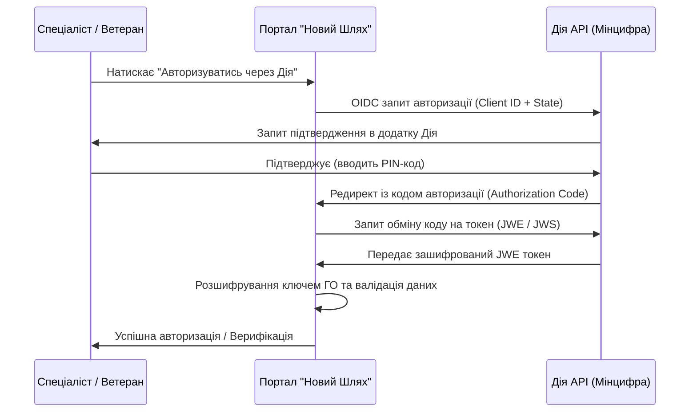

# Покроковий чек-лист підключення інтеграції з державним сервісом «Дія»
**ГО «ТАЛАН ЮА» | Проєкт «Новий Шлях»**

Цей документ визначає юридичні, організаційні та технічні кроки, необхідні для підключення порталу «Новий Шлях» до API державного сервісу «Дія» (Дія.Шеринг документів та Дія.Підпис для авторизації) відповідно до стандартів Мінцифри.

---

## 📌 Загальна схема взаємодії


---

## ⚖️ Етап 1: Юридичне підключення та Договір
- [ ] **1. Перевірка статусу організації:**
  - Наявність чинного статусу юридичної особи (ГО «ТАЛАН ЮА», ЄДРПОУ: 43911075).
  - Підтверджений КВЕД (бажано **94.99** - Діяльність інших громадських організацій).
- [ ] **2. Подача офіційного листа-запиту:**
  - Направити офіційне звернення до Міністерства цифрової трансформації (або ДП «Дія») про намір інтегрувати сервіси «Дія.Шеринг» та «Дія.Підпис».
  - У листі обов'язково вказати соціальну мету проєкту «Новий Шлях» (допомога ветеранам війни та їхнім родинам).
- [ ] **3. Укладання Договору:**
  - Укласти двосторонній договір з ДП «Дія» про надання доступу до тестового середовища (Testbed), а згодом — до продуктивного середовища.

---

## 🔑 Етап 2: Організаційно-технічна підготовка
- [ ] **1. Генерація криптографічних ключів (ДСТУ 4145 або RSA):**
  - Згенерувати пару ключів за допомогою OpenSSL для підпису запитів та розшифрування JWE payload.
  - Формат ключа: PEM (private key) та DER/PEM (public key).
  - Зразок команди для генерації RSA:
    ```bash
    openssl genpkey -algorithm RSA -out diia_private.pem -pkeyopt rsa_keygen_bits:2048
    openssl rsa -pubout -in diia_private.pem -out diia_public.pem
    ```
- [ ] **2. Реєстрація ІР-адрес:**
  - Передати представникам ДП «Дія» статичні IP-адреси серверів порталу «Новий Шлях» для додавання в білий список (IP Whitelisting).
- [ ] **3. Отримання технічних реквізитів:**
  - Отримати від ДП «Дія» унікальні:
    - `DIIA_CLIENT_ID` (ідентифікатор інтеграції).
    - `DIIA_ACQUIRER_TOKEN` (токен запитувача).
    - Публічний сертифікат сервісу Дія для перевірки JWS підписів.

---

## 💻 Етап 3: Налаштування середовища та розробка
- [ ] **1. Конфігурація файлу `.env`:**
  - Перенести отримані параметри до конфігураційного файлу `/backend/.env`:
    ```ini
    DIIA_ENVIRONMENT=production
    DIIA_CLIENT_ID=your_official_client_id_here
    DIIA_ACQUIRER_TOKEN=your_acquirer_token_here
    DIIA_PRIVATE_KEY_PATH=/secure_vault/diia_private.pem
    ```
- [ ] **2. Тестування API в режимі Sandbox (Testbed):**
  - Виконати тестову інтеграцію за допомогою `diia_integration.py` на тестових серверах (`https://api2.test.diia.gov.ua`).
  - Перевірити коректність обробки OIDC Callback.
- [ ] **3. Реалізація розшифрування токенів:**
  - Підключити бібліотеку `authlib` або `jwcrypto` для розшифрування JWE-пакетів та верифікації JWS-підпису державним ключем.
  - Перевірити відповідність полів розшифрованого JSON-документа (ПІБ, РНОКПП).

---

## 🧪 Етап 4: Проходження тестування та модерація Мінцифри
- [ ] **1. Проходження тестувальних сценаріїв:**
  - Спільно з технічною підтримкою Дії виконати обов'язкові тестові сценарії (успішна верифікація, скасування користувачем, невалідний токен).
- [ ] **2. Погодження макетів інтерфейсу:**
  - Передати макети екранів використання брендбуку «Дія» (кнопки, логотипи) на затвердження дизайнерам Мінцифри.
- [ ] **3. Отримання продуктових ключів (Go-Live):**
  - Після успішного завершення тестів підписати додаткову угоду та отримати лінк на продуктове API (`https://api2.diia.gov.ua`).

---

## 🚨 Етап 5: Запуск у Продакшен та Безпека
- [ ] **1. Захист приватного ключа:**
  - Зберігати `diia_private.pem` виключно у захищеному сховищі (наприклад, Docker Secrets, AWS Secrets Manager або окремо змонтована папка з правами доступу `chmod 400`).
- [ ] **2. Логування помилок без персональних даних:**
  - Заборонити логування розшифрованих персональних даних користувачів. Зберігати лише факт успішності / код помилки верифікації.
- [ ] **3. Запуск моніторингу працездатності (Health Check):**
  - Додати перевірку доступності шлюзу Дії в загальну систему моніторингу порталу.
