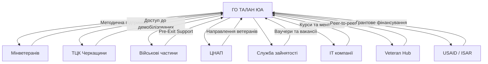

# 🕊️ СТРАТЕГІЧНИЙ ПЛАН "НОВИЙ ШЛЯХ" — Повна Дорожня Карта

**Організація:** ГО «ТАЛАН ЮА» (ЄДРПОУ: 45119390)
**Дата:** 06.05.2026 | **Регіон пілоту:** Черкащина
**Місія:** Створення комплексної екосистеми реінтеграції ветеранів.

---

## ✅ ЮРИДИЧНИЙ АУДИТ СТАТУТУ — ПРОЙДЕНО

Статут (Протокол №1 від 14.02.2023) **повністю покриває** всю діяльність проєкту:

| Напрямок проєкту | Пункти Статуту |
|:---|:---|
| Соціальна підтримка ветеранів | п. 3.2.1, 3.2.4, 3.2.6 |
| Реабілітація та протезування | п. 3.2.5, 3.2.26-3.2.28, 3.2.47 |
| Психологічна допомога | п. 3.2.6, 3.2.23 |
| Освіта та тренінги | п. 3.2.19, 3.2.20, 3.2.21 |
| Створення порталу/медіа | **п. 2.4.16** (засновувати ЗМІ), **п. 3.2.40** (видавнича діяльність) |
| Грантова діяльність | п. 2.4.17 |
| Міжнародна співпраця | п. 2.4.15, Розділ 8 |

> [!TIP]
> **Жодних змін до Статуту не потрібно.** п. 3.2.32 — лише "сприяння створенню", але пряме створення порталу покрито п. 2.4.16 та 3.2.40.

---

## ФАЗА 1: ЮРИДИЧНА БАЗА (Місяць 1-2)

### 1.1 Меморандуми про співпрацю

#### З ким підписувати та навіщо:

| Структура | Що нам дає | Що ми даємо їм | Формат документу |
|:---|:---|:---|:---|
| **ТЦК та СП Черкащини** | Доступ до демобілізованих (QR-коди, стенди) | Зменшення соцнапруги, готові рішення | Меморандум |
| **Військові частини (ВЧ)** | "Перед-екзитне" консультування бійців | Підтримка морального духу | Меморандум + Лист-звернення |
| **ЦНАП Черкас** | Канал направлення ветеранів до нас | Розвантаження від консультацій | Меморандум |
| **Служба зайнятості** | Направлення на наші програми | Покращення статистики працевлаштування | Угода про інформобмін |
| **ВНЗ (ЧДТУ, ЧНУ)** | Пільгові місця для ветеранів | Абітурієнти + соцпроєкти | Меморандум |

#### Структура Меморандуму (шаблон):
1. Преамбула (хто сторони, на підставі чого діють)
2. Предмет (консолідація зусиль у сфері ветеранської підтримки)
3. Напрями співпраці (конкретний перелік)
4. Принципи (добровільність, відсутність фін. зобов'язань)
5. Координатори від кожної сторони
6. Строк дії, порядок розірвання
7. Реквізити та підписи

> [!IMPORTANT]
> Фінансових зобов'язань у Меморандумі НЕ буде — це декларація намірів. Фінанси — окремими договорами.

### 1.2 Рада Ветеранів-Амбасадорів

**Хто це:** Ветерани будь-яких спеціальностей (НЕ юристи), які на власному досвіді пройшли адаптацію і готові мотивувати інших.

**Покроковий план створення:**
1. Знайти 3-5 ветеранів через Veteran Hub Черкаси / соцмережі
2. Провести установчу зустріч, пояснити роль
3. Підписати Згоду на використання їхніх історій (GDPR-compliant)
4. Створити їм профілі на порталі як "Наставники"
5. Запустити серію відео-інтерв'ю "Мій Новий Шлях"

---

## ФАЗА 2: ЦИФРОВА ЕКОСИСТЕМА (Місяць 2-4)

### 2.1 Портал "Новий Шлях" (Поточний стан)
- ✅ Лендінг (index.html) — готовий
- ✅ Кабінет (cabinet.html) — готовий
- ✅ Accessibility Widget (WCAG) — готовий
- ✅ Backend (server.py + specialists.json) — готовий
- ✅ AI Scout для моніторингу грантів — готовий

### 2.2 Що потрібно добудувати:
1. **Освітній хаб** — сторінка з покроковими гайдами
2. **Інтеграція з Дія.Підпис** — верифікація статусу УБД
3. **Intake Bot** — автоматичне анкетування нових користувачів
4. **Система рейтингу спеціалістів** — відгуки від ветеранів
5. **SEO-оптимізація** — meta-теги, sitemap.xml, robots.txt

---

## ФАЗА 3: ЗАЛУЧЕННЯ СПІЛЬНОТИ (Місяць 3-6)

### 3.1 Канали залучення ветеранів

| Канал | Дія | Очікуваний результат |
|:---|:---|:---|
| **Facebook-групи бригад** | Публікація корисних гайдів + посилання | 50-100 переходів/міс |
| **Telegram-канали** | Бот @NovyShlyakhBot | Автоматична реєстрація |
| **ТЦК (стенди/QR)** | Друковані матеріали | Оффлайн → Онлайн конверсія |
| **Veteran Hub** | Партнерські івенти | Довіра через бренд |
| **Сарафанне радіо** | Амбасадори | Найякісніший трафік |

### 3.2 Робота з військовими частинами

**Протокол "Pre-Exit Support":**
1. Лист командиру ВЧ з пропозицією провести інфо-сесію
2. Підготовка "Пакету переходу" (брошура + QR на портал)
3. 45-хвилинний вебінар: "Що вас чекає на цивілці: гранти, навчання, права"
4. Активація чат-бота для кожного учасника

### 3.3 Нетворкінг-заходи

- **"Ветеранські вечори"** — щомісячні зустрічі у Черкасах (кафе/коворкінг)
- **Хакатони для ветеранів** — спільно з IT-компаніями
- **Спортивні реабілітаційні заходи** — біг, плавання, йога (п. 3.2.47 Статуту)

---

## ФАЗА 4: МАРКЕТИНГ ТА SEO (Місяць 4-8)

### 4.1 SEO-стратегія

**Семантичне ядро (ключові запити):**

| Кластер | Запити | Пріоритет |
|:---|:---|:---|
| Гранти | "гранти для ветеранів 2026", "єробота для УБД" | 🔴 Високий |
| Навчання | "безкоштовні курси для ветеранів", "ваучер на навчання" | 🔴 Високий |
| Реабілітація | "реабілітація після поранення", "протезування безкоштовно" | 🟡 Середній |
| Юридичне | "пільги для УБД 2026", "як отримати статус учасника бойових дій" | 🔴 Високий |
| Психологія | "ПТСР допомога", "психолог для ветеранів Черкаси" | 🟡 Середній |

**Content Hub (статті для SEO):**
1. "Як отримати грант до 1 млн грн через Дію — покрокова інструкція"
2. "Ваучер на навчання 33 280 грн: хто може, як подати (дедлайн 3 роки!)"
3. "Топ-10 безкоштовних IT-курсів для ветеранів у 2026"
4. "Пільги для сімей ветеранів: повний список"

### 4.2 Таргетована реклама (Facebook/Instagram)

**Аудиторії:**
- Чоловіки 25-45, інтереси: ЗСУ, військова тематика
- Жінки 25-50, інтереси: сім'ї військових, волонтерство
- Lookalike на основі підписників ветеранських спільнот

**Етика:** Без маніпуляцій, без героїзації, без жалю. Тон — повага + практична користь.

**Бюджет:** Старт з 2000 грн/міс на тестування креативів.

### 4.3 Telegram-стратегія
- Канал `@NovyShlyakh` — щоденні дайджести грантів та подій
- Бот `@NovyShlyakhBot` — автоматична навігація по послугах
- Закрита група для Амбасадорів

---

## ФАЗА 5: ДЕРЖАВНІ ТА СОЦІАЛЬНІ ПРОГРАМИ (Довідник)

### 5.1 Гранти на бізнес

| Програма | Сума | Умови | Де подавати |
|:---|:---|:---|:---|
| **єРобота "Власна справа"** | 250K-1M грн | Створення 1-4 роб. місць | Дія / Ощадбанк |
| **УВФ "Варто"** | 500K-1.5M грн | Конкурс бізнес-планів | veteranfund.mva.gov.ua |
| **REDpreneurUA (Червоний Хрест)** | 7-15K EUR | Соціальний бізнес | redcross.org.ua |
| **USAID HOVERLA** | індивідуально | Розвиток громад | Через партнерські ГО |
| **ISAR Єднання** | до 500K грн | Інституційний розвиток ГО | ednannia.ua |
| **EU4Veterans** | індивідуально | Програми ЄС для ветеранів | Через профільні ГО |
| **NATO Trust Fund** | індивідуально | Перепідготовка військових | Через Мінветеранів |
| **GIZ Skills4Recovery** | індивідуально | Освіта/працевлаштування | giz.de |
| **IREX** | індивідуально | Реінтеграція ветеранів | irex.org |

### 5.2 Освіта та перекваліфікація

> [!WARNING]
> **Критичний дедлайн:** Ваучер треба оформити протягом **3 років** з дня звільнення зі служби! Це треба показувати на порталі великим шрифтом.

**А) Державні компенсації (ДВІ окремі програми!):**

| Програма | Сума | Через кого подавати | Особливості |
|:---|:---|:---|:---|
| **Ваучер** (Служба зайнятості) | **33 280 грн** (10×ПМ) | Центр зайнятості / dcz.gov.ua | Дедлайн 3 роки! Не можна бути зареєстр. безробітним |
| **Професійна адаптація** (Мінветеранів) | **45 420 грн** (15×ПМ) | Підрозділ ветеранської політики за місцем реєстрації | Магістратура, перепідготовка, кваліф. центри |

**Б) Платформи-агрегатори:**
- 🌐 **osvitaveteraniv.gov.ua** — 1200+ курсів, прогноз професій до 2027 (МОН + GIZ Skills4Recovery)
- 🌐 **enableme.com.ua** — добірки від IT до робітничих професій

**В) Безкоштовні IT-курси:**

| Програма | Спеціалізації |
|:---|:---|
| **EPAM "IT для ветеранів"** | Java, .NET, QA, Cloud & DevOps, Front-End, BA |
| **SoftServe EmpowerU** | DevOps, Python, тестування |
| **GlobalLogic Education** | Менторство + індивідуальний план розвитку |
| **Beetroot Academy** | Frontend, QA, Python, PM, UX, Digital Marketing |
| **Projector Foundation** | PM, SMM, дизайн + HR-підтримка |
| **Academy4Heroes (Львів)** | Python, C++ MilTech, Full Stack, QA Auto (30 ECTS, практика в ELEKS/SoftServe) |
| **Choice31 (Netpeak)** | PM, BA, PPC |

**Г) НЕ-IT перекваліфікація:**

| Програма | Професії | Особливості |
|:---|:---|:---|
| **Reskilling Ukraine (UNIT 6.0)** | Монтажник сонячних станцій, автомеханік, водій | 3-6 тижнів, покриття проживання |
| **МОМ (20 професій)** | Різні робітничі | Тільки Львів, ІФ, Дніпро обл. |
| **Unbroken + ЮНІДО "ReStart"** | Від ідеї до ветеранського бізнесу | Бізнес-курс |

### 5.3 Працевлаштування

| Платформа | Що дає | Посилання |
|:---|:---|:---|
| **«Кар'єра ветерана»** | База вакансій + конструктор резюме | work.veteranfund.com.ua |
| **Lobby X (тег veterans)** | Рекрутинг з фільтром для ветеранів | lobbyx.com |
| **Work.ua (розділ ветерани)** | Загальний ринок з ветеранською секцією | work.ua |
| **Платформа «Курс»** | Навчання → працевлаштування | kurs.com.ua |
| **Academy for Heroes** | Безкоштовно | Python, sysadmin, Marketing |
| **Choice31 (Netpeak)** | Безкоштовно | PM, BA, PPC |

### 5.3 Реабілітація

| Центр | Спеціалізація | Вартість |
|:---|:---|:---|
| **Superhumans Center** | Протезування, реконструкція | Безкоштовно |
| **UNBROKEN (Незламні), Львів** | Повний цикл реабілітації | Безкоштовно |
| **Мережа RECOVERY** | Комплексна реабілітація | Безкоштовно |
| **"Лісова Поляна"** | ПТСР, контузії | Безкоштовно (НСЗУ) |
| **Реабілітаційна платформа** | Пошук центрів по регіону | rehab.moz.gov.ua |

### 5.4 Житлові програми
- **Грошова компенсація на житло** — для інвалідності І-ІІ групи
- **Компенсація оренди** — для ветеранів без власного житла
- **75% знижка на ЖКГ** — для учасників бойових дій

---

## ФАЗА 6: ФІНАНСОВА СТІЙКІСТЬ (Місяць 6-12)

### 6.1 Джерела фінансування

| Джерело | Тип | Очікувана сума |
|:---|:---|:---|
| **УВФ "Варто"** | Грант | до 1.5 млн грн |
| **ISAR Єднання** | Грант (інст. розвиток) | до 500K грн |
| **USAID** | Грант (через партнерів) | індивідуально |
| **CSR корпорацій** | Спонсорство | 50-200K грн |
| **Членські внески** | Регулярні | 5-10K грн/міс |
| **Донати фіз. осіб** | Разові | непрогнозовано |

### 6.2 CSR-партнерства (план виходу на бізнес)
1. **Нова Пошта** — спонсорство доставки для ветеранів
2. **Епіцентр** — знижки на будматеріали для ветеранського житла
3. **Monobank** — інтеграція збору коштів через банку
4. **IT-компанії** — спонсорство навчальних програм

---

## КАРТА СТЕЙКХОЛДЕРІВ (Хто → Де → Що)

---

## РИЗИКИ ТА ЗАХИСТ

| Ризик | Ймовірність | Захист |
|:---|:---|:---|
| Недовіра до "чергової ГО" | 🔴 Висока | Амбасадори + інтеграція Дія + відкрита звітність |
| Витік даних ветеранів | 🟡 Середня | Шифрування, Дія.Підпис, "Право бути забутим" |
| Відсутність фінансування | 🟡 Середня | Диверсифікація: гранти + CSR + донати |
| Вигорання команди | 🟡 Середня | Чіткий розподіл ролей, автоматизація через AI |

---

## ВІДКРИТІ ПИТАННЯ ДО КОРИСТУВАЧА

1. Чи є пріоритетний регіон для пілоту (Черкаси підтверджено з Маніфесту)?
2. Чи були вже контакти з ТЦК або ВЧ Черкащини?
3. Фізичний хаб чи тільки цифровий портал на першому етапі?
4. Бюджет на таргетовану рекламу — готові почати з 2000 грн/міс?
5. Хто з команди буде координатором перемовин зі стейкхолдерами?
